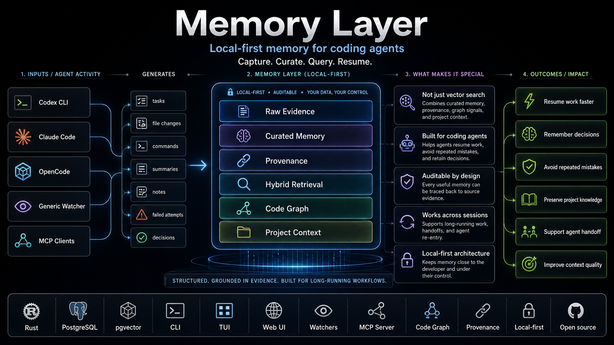
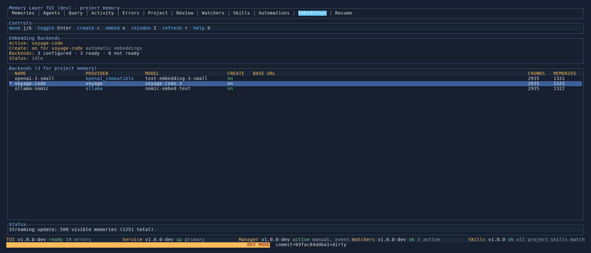

# Memory Layer

Memory Layer is a local-first memory system for coding agents and developers. It turns project work into durable, searchable knowledge so the next Codex, Claude, or human session can start with evidence instead of guesswork.

It captures what happened, curates what matters, stores it in PostgreSQL with pgvector, and exposes it through a fast TUI, browser UI, and agent-friendly CLI.


## Measured Impact

Memory Layer is built to be evaluated, not just demoed. Its eval harness runs
paired ablations such as `no-memory` vs `full-memory`, writes immutable
artifacts, compares item-by-item results, applies gates, and reports token and
latency cost.

**Latest report:** the valid `2026-05-03` Dockerized
[`memory-improvement-v1` benchmark](docs/developer/evaluation-runs/2026-05-03-memory-improvement-v1-full.md)
ran five paired repeats against hidden memory-only facts, graph-backed
retrieval checks, and grounded-answer tasks. Full Memory moved aggregate
success from `0.0%` to `18.1%`, Recall@K/MRR/nDCG from `0.000` to `1.000`,
assertion recall from `0.000` to `0.725`, and total tokens from `22,069,461`
to `12,970,186`, a `41.2%` reduction.

The result is deliberately specific: it shows strong improvement for retrieval
and grounded answers, while the report calls out that long-running autonomous
coding continuity still needs verified Memory-query evidence before making a
stronger claim.

Read the [Beginner Guide To Evaluations](docs/user/evaluation-guide.md), the
[`memory eval` CLI reference](docs/user/cli/eval.md), and the full
[benchmark report](docs/developer/evaluation-runs/2026-05-03-memory-improvement-v1-full.md).

## Why It Is Interesting

- **Answers with evidence:** ask a project question and see both the synthesized answer and the exact memories used to produce it.
- **Code graph-aware retrieval:** extract parser-backed symbols, references, and graph edges, then let query use that structure to find memories connected to the code you ask about.
- **Multi-embedding search:** keep OpenAI, Voyage, Cohere, Gemini, or local OpenAI-compatible embedding spaces side by side, then switch the active retrieval backend without recomputing.
- **Distributed agents:** monitor Codex and Claude sessions across projects, including token pressure, context usage, rate limits, process details, and open ports.
- **Agent-linked watchers:** background watchers attach to agent sessions, identify the project automatically, heartbeat to the service, and stop when the owning agent exits.
- **Built-in MCP server:** expose read-only project memory tools to Codex, Claude, and other MCP clients over stdio or local Streamable HTTP.
- **Get up to speed:** persisted activity events, recent memory changes, commits, warnings, and token summaries become a briefing for new or returning agents.
- **Repeatable evaluation:** run paired no-memory vs full-memory ablations with artifacted results, gates, token accounting, and concrete retrieval-quality metrics.
- **Human review loop:** curation can queue replacement proposals so important memory changes can be approved before older knowledge is superseded.



## Table of Contents

- [Quick Start](#quick-start)
- [Agent Install Prompt](#agent-install-prompt)
- [Quick Start (Developers)](#quick-start-developers)
- [Feature Tour](#feature-tour)
- [Documentation](#documentation)
- [Development](#development)
- [License](#license)

## Quick Start

Prefer an agent to do the install? [Jump to install with coding agent](#agent-install-prompt).

The fastest path is:

1. Create a PostgreSQL database for Memory Layer and enable the `vector` extension in that database.
2. Install the package.
3. Run `memory wizard --global` once per machine and enter the database URL.
4. Choose the project directory or repository Memory Layer should manage.
5. Run `memory wizard` inside that project to create or refresh repo-local Memory Layer config.
6. Let Memory Layer auto-derive a writer identity, or set `writer.id` only if you want a custom shared label.
7. Start `memory service run` or enable the packaged service.
8. Open the TUI or web UI.

Example database URL:

```text
postgres://memory_layer:<password>@127.0.0.1:5432/memory_layer
```

If you are running PostgreSQL locally, create a dedicated database and user first:

```bash
sudo -u postgres createuser --pwprompt memory_layer
sudo -u postgres createdb --owner=memory_layer memory_layer
```

On macOS/Homebrew PostgreSQL, the same commands usually run without `sudo -u postgres`:

```bash
createuser --pwprompt memory_layer
createdb --owner=memory_layer memory_layer
```

Before running the wizard, verify that the database exists and is reachable from the same machine:

```bash
export DATABASE_URL='postgres://memory_layer:<password>@127.0.0.1:5432/memory_layer'
psql "$DATABASE_URL" -c "SELECT 1;"
psql "$DATABASE_URL" -c "CREATE EXTENSION IF NOT EXISTS vector;"
psql "$DATABASE_URL" -c "SELECT extversion FROM pg_extension WHERE extname = 'vector';"
```

Preview and create repo-local Memory Layer configuration inside the project:

```bash
cd /path/to/your-project
memory wizard --dry-run
memory wizard
```

Debian:

```bash
sudo dpkg -i memory-layer_<version>_amd64.deb
memory wizard --global
cd /path/to/your-project
memory wizard --dry-run
memory wizard
sudo systemctl enable --now memory-layer.service
memory tui
```

macOS:

```bash
brew tap 3vilM33pl3/memory https://github.com/3vilM33pl3/memory
brew install 3vilM33pl3/memory/memory-layer
memory wizard --global
cd /path/to/your-project
memory wizard --dry-run
memory wizard
memory service enable
memory tui
```

For unreleased changes from `main`:

```bash
brew install --HEAD 3vilM33pl3/memory/memory-layer
```

For the full onboarding flow, prerequisites, upgrade path, and troubleshooting, use [Getting Started](docs/user/getting-started.md).

### Agent Install Prompt

Give this prompt to an agent when you want it to install Memory Layer for you:

````
# Install Memory Layer

You are installing Memory Layer for me. Work in the terminal, explain before using sudo, and stop before destructive changes.

## Goal

Install Memory Layer completely on this machine and configure it for the project I choose.

Repository: https://github.com/3vilM33pl3/memory
GitHub Releases: https://github.com/3vilM33pl3/memory/releases

## Rules

- Detect whether this is Linux/Debian-style or macOS.
- Do not invent secrets.
- PostgreSQL is required. Before running `memory wizard --global`, find an existing database URL or ask me whether to use an existing/hosted PostgreSQL database or create a local one.
- If creating a local PostgreSQL database, create a dedicated database and user named `memory_layer` unless I ask for different names.
- Do not invent the database password; ask me for it or generate one only after confirming that is OK.
- Make sure the PostgreSQL server has pgvector installed and that the target database has `CREATE EXTENSION IF NOT EXISTS vector;` applied.
- Verify PostgreSQL with `psql "$DATABASE_URL" -c "SELECT 1;"` and verify pgvector with `psql "$DATABASE_URL" -c "SELECT extversion FROM pg_extension WHERE extname = 'vector';"` before configuring Memory Layer.
- Ask me for optional LLM or embedding API keys only if I want scan or semantic retrieval.
- Make sure Go is available on PATH so repo-local Memory Layer skills can run.
- Run health checks before saying the install is done.

## Linux / Debian path

1. Download the latest Memory Layer `.deb` from https://github.com/3vilM33pl3/memory/releases.
2. Install it with `sudo dpkg -i memory-layer_<version>_amd64.deb`.
3. Prepare PostgreSQL before configuring Memory Layer:
   - If using a hosted/existing database, verify that it accepts connections from this machine and supports pgvector.
   - If creating a local database, install PostgreSQL and the matching pgvector package for the server major version, for example `postgresql-16-pgvector` when the server is PostgreSQL 16.
   - Create or receive a database URL such as `postgres://memory_layer:<password>@127.0.0.1:5432/memory_layer`.
   - Run `psql "$DATABASE_URL" -c "CREATE EXTENSION IF NOT EXISTS vector;"`.
   - Run `psql "$DATABASE_URL" -c "SELECT 1;"` and `psql "$DATABASE_URL" -c "SELECT extversion FROM pg_extension WHERE extname = 'vector';"`.
4. Run `memory wizard --global` and configure the verified database URL and optional LLM/embedding settings.
5. Go to my target project directory.
6. Run `memory wizard --dry-run`, then `memory wizard` for repo-local setup.
7. Start the backend with `sudo systemctl enable --now memory-layer.service`.
8. Run `memory doctor`, `memory health`, and then open `memory tui`.

## macOS path

1. Run `brew tap 3vilM33pl3/memory https://github.com/3vilM33pl3/memory`.
2. Run `brew install 3vilM33pl3/memory/memory-layer`.
3. Prepare PostgreSQL before configuring Memory Layer:
   - If using a hosted/existing database, verify that it accepts connections from this machine and supports pgvector.
   - If creating a local database, use Homebrew PostgreSQL and pgvector, then create a dedicated `memory_layer` database and user.
   - Create or receive a database URL such as `postgres://memory_layer:<password>@127.0.0.1:5432/memory_layer`.
   - Run `psql "$DATABASE_URL" -c "CREATE EXTENSION IF NOT EXISTS vector;"`.
   - Run `psql "$DATABASE_URL" -c "SELECT 1;"` and `psql "$DATABASE_URL" -c "SELECT extversion FROM pg_extension WHERE extname = 'vector';"`.
4. Run `memory wizard --global` and configure the verified database URL and optional LLM/embedding settings.
5. Go to my target project directory.
6. Run `memory wizard --dry-run`, then `memory wizard` for repo-local setup.
7. Start the backend with `memory service enable`.
8. Run `memory doctor`, `memory health`, and then open `memory tui`.

## Finish

Report what was installed, where the config files are, whether the service is healthy, and what I should run next.
````

### Agent Repo Memory Init Prompt

Give this separate prompt to an agent when Memory Layer is installed already and you want it to configure a specific project:

````
# Initialize Repository For Memory Layer

You are configuring an existing project for Memory Layer. Work in the terminal, explain before changing files, and stop before destructive changes.

## Goal

Create or refresh repo-local Memory Layer configuration so agents can write, query, and curate project memory safely.

## Rules

- Work in the target project directory I give you.
- Do not install the system package; this prompt is only for repo-local Memory Layer setup.
- Do not create or reinitialize git history.
- Do not delete existing `.mem/`, `.agents/`, or Memory Layer config files.
- If `.mem/project.toml`, legacy `.mem/config.toml`, `.agents/memory-layer.toml`, or `.agents/skills/` already exist, inspect them and preserve local customizations.
- Ask me before overwriting files, rotating credentials, importing history, or running a write operation that was not previewed.
- Make sure the shared backend is configured and healthy before saying setup is done.
- Make sure Go is available on `PATH` because repo-local Memory Layer skills use the Go helper.

## Steps

1. Run `memory health` and `memory doctor`.
2. Run `memory wizard --dry-run` in the target project to preview setup.
3. Run `memory wizard` to create or refresh the user-local project config, `.mem/project.toml`, and `.agents/` Memory Layer files.
4. Run `memory doctor` again.
5. If commit history should be available as evidence, run `memory commits sync --project <project-slug> --dry-run`, then run it for real only if the preview looks correct.
6. If an initial scan is wanted, run `memory scan --project <project-slug> --dry-run`, then run it for real only after I approve the preview.
7. Open `memory tui` or report the project slug and next commands.

## Finish

Report which project files/configs were created or preserved, the project slug, backend health, and any follow-up actions.
````

Key docs after setup:

- [TUI Guide](docs/user/tui/README.md) for the visual workflow.
- [Embedding Operations](docs/user/cli/embeddings.md) for multi-backend semantic search and model switching.
- [Code Graph Extraction](docs/user/cli/graph.md) for parser-backed code structure and graph-aware query ranking.
- [Watcher Health](docs/user/cli/watchers.md) for distributed watcher behavior.
- [Query Command](docs/user/cli/query.md) for cited answers from memory.
- [Get Up To Speed](docs/user/cli/up-to-speed.md) for new-agent briefings.
- [Beginner Guide To Evaluations](docs/user/evaluation-guide.md) for measuring whether Memory improves agent behavior.
- [Memory Bundles](docs/user/cli/bundles.md) for shareable backup and restore.

Most mutating `memory` commands support `--dry-run` so agents can preview writes, service actions, and plan/checkpoint flows before applying them.

## Quick Start (Developers)

If you are working on Memory Layer itself, you can run a development copy from a `cargo` checkout that is **fully isolated** from any packaged install on the same machine — separate ports, separate Cap'n Proto socket, separate runtime directory. The TUI shows `[dev]` in its header so you cannot mistake one for the other.

The mechanism: any `memory` binary launched from `target/{debug,release}/` activates the `dev` profile, which layers the user-local project `config.dev.toml` on top of the user-local project `config.toml` and ignores the global config entirely. Override with `MEMORY_LAYER_PROFILE=dev|prod` when needed.

```bash
git clone https://github.com/3vilM33pl3/memory
cd memory
npm --prefix web ci && npm --prefix web run build

# Bootstrap the repo-local base config and the dev overlay.
cargo run --bin memory -- init
cargo run --bin memory -- dev init --copy-from-global

# Each piece in its own shell, all on the dev stack.
cargo run --bin memory -- service run            # backend (4250 HTTP, 4251 capnp)
cargo run --bin memory -- watcher manager run    # optional
cargo run --bin memory -- tui                    # header reads [dev]
```

`--copy-from-global` lifts the database URL and LLM/embedding endpoints from the installed config into the dev overlay so credentials are not duplicated.

| Stack | HTTP | capnp TCP | capnp Unix socket |
| --- | --- | --- | --- |
| Installed (Debian/Homebrew package) | `127.0.0.1:4040` | `127.0.0.1:4041` | `/tmp/memory-layer.capnp.sock` |
| Dev (cargo-run from repo) | `127.0.0.1:4250` | `127.0.0.1:4251` | user-local project runtime `runtime/dev/memory-layer.capnp.sock` |

For the full isolation contract, override flags, troubleshooting, and the verification recipe, see [Dev Stack vs Installed Stack](docs/developer/dev-stack.md).

## Feature Tour

### Search That Explains Itself

The Query tab and `memory query` combine lexical search, vector search, relation boosts, graph boosts, and memory filters. Results are labelled as `lexical`, `semantic`, or `hybrid`, and answers cite the ranked memories that supported them.

When a completed code graph exists, query also looks at parser-backed symbols, references, and one-hop graph edges. Those graph hits are mapped back to curated memories through file provenance, so the system can explain why a memory about a function, module, or call path was retrieved without treating raw graph rows as answer citations.


### Evaluation That Measures Memory

Memory Layer includes a repeatable evaluation harness so improvements can be
measured instead of guessed. Eval suites run the same tasks under paired
conditions, such as `no-memory` and `full-memory`, then write immutable
artifacts, compare item-by-item results, apply gate policies, and report token
and latency deltas.

The current featured run is the valid `2026-05-03` Dockerized
`memory-improvement-v1` benchmark highlighted above. It combines hidden
memory-only facts, reasoning-mode groups, multi-step continuity tasks,
graph-backed retrieval checks, token accounting, latency tracking, and optional
LLM judging. That is the point of the harness: it shows where Memory helps and
where the next engineering work belongs.

Start with the [Beginner Guide To Evaluations](docs/user/evaluation-guide.md),
use [`memory eval`](docs/user/cli/eval.md) for the command reference, and see
the latest recorded
[memory-improvement run](docs/developer/evaluation-runs/2026-05-03-memory-improvement-v1-full.md)
for the current evidence and caveats.

### Code Graph Memory

`memory graph extract` turns the repository into durable code structure: symbols, references, resolved edges, unresolved references, and evidence spans. This makes Memory Layer more than a vector database: it can connect natural-language project memory to concrete code relationships.

Why this matters:

- questions about a symbol can retrieve memories attached to the files and neighboring symbols around it
- graph diagnostics show whether retrieval used code structure, how many graph candidates were found, and which connections affected ranking
- graph extraction itself is persisted as an activity, so new agents can see when the project’s code map was refreshed
- unresolved and ambiguous references are stored explicitly, giving future analyzers and curation workflows a measurable improvement path

See [Code Graph Extraction](docs/user/cli/graph.md) and [Query Command](docs/user/cli/query.md).

### Multiple Embedding Backends

Memory Layer can keep several embedding spaces populated at once. That means you can compare OpenAI and Voyage retrieval, migrate models safely, or keep a local OpenAI-compatible backend around without losing existing vectors.



### Distributed Agent Awareness

The Agents and Watchers tabs show what is running now: agent sessions, project ownership, context pressure, rate limits, watcher heartbeats, restart attempts, and stale processes.


### Activity And Re-Entry

The Activity and Resume views turn persisted interactions into operational history and concise re-entry briefings. This is the "get up to speed" path for a fresh agent joining an active project.


### Durable Project Knowledge

Memory is scoped by project, typed by purpose, linked to provenance, and curated into canonical entries. The Memories and Review tabs make it possible to inspect, maintain, and approve changes to that knowledge base.


Project-local customization now has two layers:

- user-local project config/state/cache directories for runtime overrides and generated state
- `.mem/project.toml` for the small repo-local project marker
- `.agents/memory-layer.toml` for project-owned memory behavior such as include/ignore paths and future analyzers/plugins

## Documentation

The Fumadocs / Next.js documentation website source lives in [`docs-site/`](docs-site/README.md). It is organized for reader-facing onboarding, concepts, agent integrations, MCP, evaluations, operations, and reference pages, and is ready for Vercel deployment from the `docs-site` root. The `docs/` directory remains the detailed in-repo manual and developer reference.

### Start By Task

- **Install and first project:** [Getting Started](docs/user/getting-started.md), [Wizard And Bootstrap](docs/user/cli/wizard.md), [Init Bootstrap](docs/user/cli/init.md), [Skill Upgrade](docs/user/cli/upgrade.md)
- **Use the visual workflow:** [TUI Guide](docs/user/tui/README.md), [TUI Command](docs/user/cli/tui.md), [Memories Tab](docs/user/tui/memories.md), [Query Tab](docs/user/tui/query.md), [Errors Tab](docs/user/tui/errors.md)
- **Ask and explain:** [Query Command](docs/user/cli/query.md), [Code Graph Extraction](docs/user/cli/graph.md), [Embedding Operations](docs/user/cli/embeddings.md)
- **Run agents and automation:** [Watcher Health](docs/user/cli/watchers.md), [Activities](docs/user/cli/activities.md), [Get Up To Speed](docs/user/cli/up-to-speed.md), [Resume Briefings](docs/user/cli/resume.md)
- **Integrate MCP clients:** [MCP Server](docs/user/cli/mcp.md)
- **Operate and troubleshoot:** [Service Commands](docs/user/cli/service.md), [Health](docs/user/cli/health.md), [Stats](docs/user/cli/stats.md), [Doctor Diagnostics](docs/user/cli/doctor.md), [Shell Completion](docs/user/cli/completion.md)
- **Maintain memories:** [Remember](docs/user/cli/remember.md), [Curate](docs/user/cli/curate.md), [History](docs/user/cli/history.md), [Prune History](docs/user/cli/prune-history.md), [Archive](docs/user/cli/archive.md), [Bundles](docs/user/cli/bundles.md)
- **Measure and develop:** [Beginner Evaluation Guide](docs/user/evaluation-guide.md), [Automated Evaluation](docs/user/cli/eval.md), [Dev Stack](docs/developer/dev-stack.md), [Dev Command](docs/user/cli/dev.md)

### Developer Docs

- [Developer Documentation Index](docs/developer/README.md)
- [Dev Stack vs Installed Stack](docs/developer/dev-stack.md)
- [How Skills Work](docs/developer/skills/how-skills-work.md)
- [Architecture Overview](docs/developer/architecture/overview.md)
- [How Memory Layer Works](docs/developer/architecture/how-it-works.md)
- [Memory Types Reference](docs/developer/architecture/memory-types.md)
- [Hidden Memory Daemon](docs/developer/architecture/hidden-memory-daemon.md)
- [Refactor Baseline](docs/developer/refactor-baseline.md)

## License

Memory Layer is dual-licensed:

- **Open source:** GNU Affero General Public License v3.0 or later, see [LICENSE](LICENSE)
- **Commercial:** available under a separate commercial license from the copyright holder, see [LICENSE-COMMERCIAL.md](LICENSE-COMMERCIAL.md)

### What this means

If you use, modify, or host Memory Layer under the open source license, you must comply with the AGPL, including providing source code for modified networked versions.

If you want to use Memory Layer in a proprietary or closed-source commercial setting, contact the copyright holder for a commercial license.

### Contributions

Unless explicitly agreed otherwise in writing, contributions are accepted under the repository's open source license, while the maintainer retains the right to offer the project under separate commercial terms. See [CONTRIBUTING.md](CONTRIBUTING.md).

## Development

For working on this repository itself, start with [Quick Start (Developers)](#quick-start-developers) above and then [Dev Stack vs Installed Stack](docs/developer/dev-stack.md) for the isolation contract.

Packaging, architecture, and implementation details live under [Developer Documentation](docs/developer/README.md).
