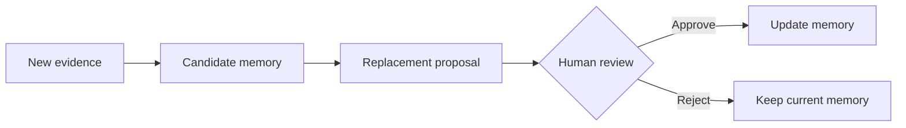

# Curation

Keep memory useful with review, replacement proposals, and stale-context handling.

## Why it matters

Coding agents need context that is scoped, current, and backed by evidence. This concept helps explain how Memory Layer avoids becoming an unstructured pile of notes.

## How Memory Layer handles it

Memory Layer captures project activity, curates durable claims, stores them with evidence, and retrieves them for humans and agents. When the concept involves trust, freshness, or provider behavior, prefer explicit verification over assumptions.

## Example

A useful memory says what changed, why it matters, and where the evidence lives. A weak memory only records that someone looked at a file.

## Design trade-offs

Memory Layer improves continuity and inspection, but it does not make old context automatically true. Stale or low-confidence memories need review.

## Related

Read [Evidence](/concepts/evidence), [Curation](/concepts/curation), and [Trust and staleness](/concepts/trust-and-staleness).

## Replacement proposal flow

