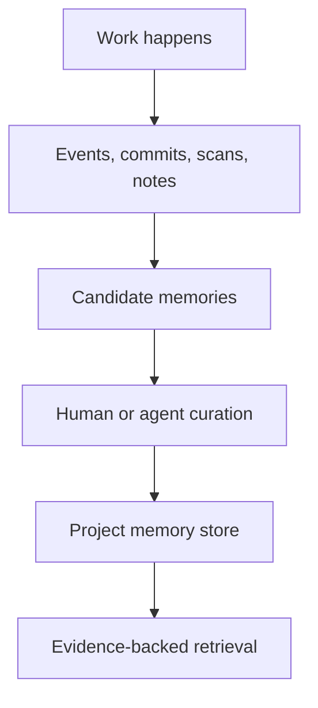

# Mental model

A project is the unit of context. A memory is a durable claim or useful fact about the project. Evidence is what makes a memory trustworthy. Curation keeps memories useful as projects change. Retrieval selects relevant memories for humans or agents. Evaluation measures whether memory improves outcomes.

## Design trade-offs

Memory Layer optimizes for useful, inspectable project context. It does not promise perfect recall, automatic truth, or a replacement for project documentation.

## Next

Read [Memories](/concepts/memories) and [Trust and staleness](/concepts/trust-and-staleness).
