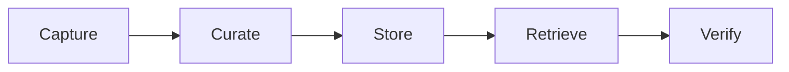

# Concepts

Memory Layer turns project activity into durable memories. Memories are useful because they are scoped to projects, linked to evidence, curated over time, and retrievable by agents when a future task needs context.

<CardGroup cols={2}>
  <Card title="Mental model" href="/docs/concepts/mental-model" />
  <Card title="Memories" href="/docs/concepts/memories" />
  <Card title="Evidence" href="/docs/concepts/evidence" />
  <Card title="Curation" href="/docs/concepts/curation" />
  <Card title="Retrieval" href="/docs/concepts/retrieval" />
  <Card title="Trust and staleness" href="/docs/concepts/trust-and-staleness" />
</CardGroup>

## Next

Start with [Mental model](/docs/concepts/mental-model), then read [Evidence](/docs/concepts/evidence).
