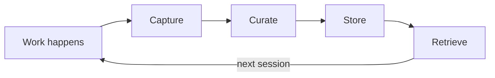
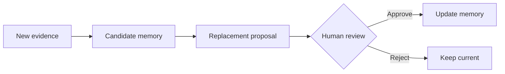
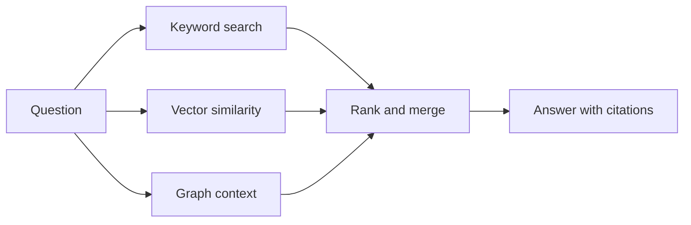

# How it works

Memory Layer turns project activity into durable, evidence-backed memory that agents and humans can retrieve in future sessions. The core loop is: **capture → curate → store → retrieve**.

## Projects

A **project** is the unit of scoping. Each project gets its own memory namespace tied to a repository or working directory. Memories, activity, and configuration are isolated per project, so context from one codebase never leaks into another.

Projects are identified by a slug (e.g. `memory`, `docs-site`) and configured through `memory wizard` or `.mem/project.toml`.

## Memories

A **memory** is a durable claim or useful fact about a project — an architectural decision, a debugging insight, a rationale for a workaround, a completed task summary.

Each memory has:

- **Canonical text** — a short, self-contained statement of the fact
- **Type** — task, fact, plan, note, feedback, or reference
- **Confidence score** — how trustworthy the memory is (0.0–1.0)
- **Tags** — for filtering and categorisation
- **Source** — the original prompt or event that produced it

A good memory says *what changed*, *why it matters*, and *where the evidence lives*. A weak memory only records that someone looked at a file.

## Evidence

Every memory tracks **where it came from**. Evidence includes commit hashes, file paths, user prompts, command output, and timestamps. This provenance makes memories auditable — you can always inspect why something was stored and whether the source is still valid.

Evidence is what separates Memory Layer from a plain note-taking tool. When an agent retrieves a memory, it can cite the evidence rather than asking you to trust an unsourced claim.

## Activity events

**Activity events** are the raw material that memories are built from. Watchers observe agent sessions and record events — prompts issued, files changed, commands run, tests executed. These events form a timeline that feeds the curation pipeline.

Not every event becomes a memory. Events are transient by default; only curated, durable facts get promoted to long-term storage.

## Curation

Curation keeps memory useful as a project evolves. Without it, memory accumulates noise, duplicates, and stale claims.

Memory Layer curates by:

- **Deduplicating** — detecting when a new memory restates something already stored
- **Scoring confidence** — rating how trustworthy a memory is based on its evidence
- **Proposing replacements** — when new evidence contradicts an older memory, a replacement proposal is created for review

Replacement proposals require human approval before older knowledge is superseded. This keeps you in control of what your agents remember.

## Embeddings

Memories are embedded into vector space for semantic search. Memory Layer supports multiple embedding providers — **Voyage**, **OpenAI**, and **Ollama** — so you can choose based on quality, cost, or privacy requirements.

Each memory can have multiple embedding chunks. Embeddings are stored alongside the memory in PostgreSQL via pgvector, and you can switch providers without losing existing embeddings.

## Code graph

Memories can be linked to **files, symbols, references, and code relationships**. When a memory is connected to specific functions, modules, or file paths, retrieval becomes context-aware — asking about a file surfaces memories related to that part of the codebase.

The code graph turns flat text memories into a connected knowledge structure that reflects how the project is actually organised. When a function or module changes, the graph makes it easier to detect which memories might be affected — so rippling changes through the codebase don't silently invalidate stored context.

## Retrieval

When an agent or human asks a question, Memory Layer combines multiple retrieval strategies:

- **Keyword search** — fast lexical matching for exact terms
- **Vector similarity** — semantic search via embeddings for meaning-based matches
- **Graph context** — file and symbol relationships to find structurally related memories

Results are ranked, merged, and returned with citations pointing back to the evidence. Every retrieval result is inspectable — you can see match type, score, and which evidence backed it.

## Trust and staleness

Memories are not permanent truths. Code changes, architectures evolve, and old decisions get revisited. Memory Layer handles this through:

- **Confidence scores** that reflect evidence quality and recency
- **Replacement proposals** when new work contradicts stored memories
- **Human review** before any memory is superseded
- **Inspectable provenance** so you can judge whether a memory is still relevant

The goal is useful context with honest uncertainty — not perfect recall.
