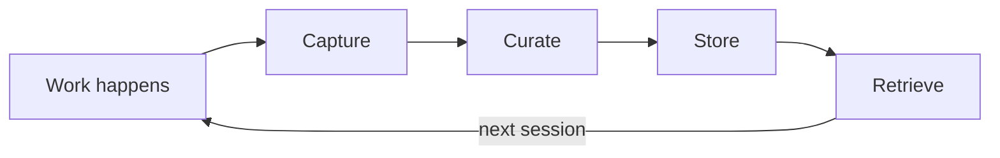
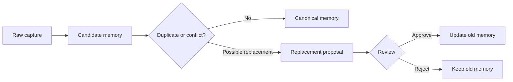
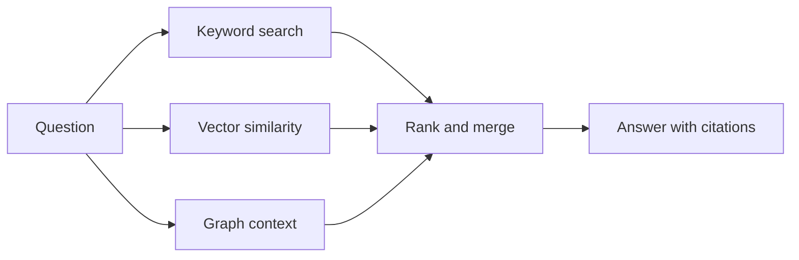

# How it works

Memory Layer turns project activity into durable, evidence-backed memory that agents and humans can retrieve in future sessions. The core loop is: **capture -> curate -> store -> retrieve**.

## Mental model

Memory Layer is not a chat transcript store. It separates short-lived activity from durable knowledge:

| Layer | What it contains | Why it matters |
|---|---|---|
| Activity | Prompts, commands, watcher heartbeats, curation events, diagnostics | Builds an audit timeline and resume context. |
| Raw captures | Structured task or tool context that may become memory | Preserves ingestion input before curation decisions. |
| Canonical memories | Human-readable, evidence-backed project facts | The durable knowledge agents query later. |
| Evidence | Files, commits, prompts, command output, timestamps, graph links | Lets humans and agents verify why a memory exists. |
| Search indexes | Full text, embeddings, graph references, ranking metadata | Makes relevant memories findable under different question styles. |

## Projects

A **project** is the unit of scoping. Each project gets its own memory namespace tied to a repository or working directory. Memories, activity, and configuration are isolated per project, so context from one codebase does not leak into another.

Projects are identified by a slug, for example `memory` or `docs-site`, and configured through `memory wizard`, `memory init`, and `.mem/project.toml`.

## Capture

Capture records what happened without deciding yet whether it is durable. Sources include:

- explicit `memory remember` calls after completed work
- structured `memory capture` payloads from tools
- repository scans
- watcher activity
- checkpoint and plan-execution events
- curation and proposal review events

Capture should preserve enough detail for later review, but it is not the same as long-term memory. A raw event can be noisy, duplicated, incomplete, or obsolete.

## Curation

Curation turns raw context into concise, human-readable memory. It removes noise, deduplicates similar facts, assigns types and confidence, links evidence, and proposes replacements when new evidence conflicts with older knowledge.

Replacement proposals require review before older knowledge is superseded. This protects the memory base from automatic overwrites when the evidence is ambiguous.

## Store

Memory Layer stores canonical memories, raw captures, history, proposals, activity, embeddings, commit evidence, and graph references in PostgreSQL with pgvector. The database is the shared backend for the CLI, TUI, browser UI, watchers, and MCP server.

The repo-local `.mem/` directory scopes a checkout to a project; it is not the database. Global config stores service, database, and provider settings outside the repository.

## Retrieve

Retrieval combines multiple strategies:

- **Keyword search** finds exact terms, paths, commands, and identifiers.
- **Vector similarity** finds semantically related text through embeddings.
- **Graph context** boosts memories connected to files, symbols, and references.
- **Ranking and diagnostics** explain match kinds, confidence, relation boosts, and timing.

## Trust and staleness

Memories are durable claims, not permanent truths. Code changes, dependencies move, and decisions are revisited. Memory Layer manages this with confidence scores, source evidence, memory history, provenance verification, replacement proposals, and explicit refactor memories that can invalidate or update affected knowledge. On top of that, [reinforcement](/docs/how-it-works/reinforcement) tracks which memories are actually used and re-validates the hot ones against your repository.

## Deep dives

<CardGroup cols={3}>
  <Card title="Memory types" href="/docs/how-it-works/memory-types">
    How task, fact, plan, feedback, refactor, and documentation memories are used.
  </Card>
  <Card title="Retrieval and search" href="/docs/how-it-works/retrieval-search">
    How lexical, semantic, graph, embedding, and ranking paths work together.
  </Card>
  <Card title="Self-maintaining memory" href="/docs/how-it-works/reinforcement">
    How activation scoring and evidence-backed validation keep hot memories accurate.
  </Card>
  <Card title="Consolidation and insights" href="/docs/how-it-works/consolidation">
    How clusters of related memories become higher-level insight memories.
  </Card>
  <Card title="Memory quality" href="/docs/how-it-works/memory-quality">
    The full map of quality mechanisms, from write-time dedup to release-gated evals.
  </Card>
  <Card title="Runtime topology" href="/docs/how-it-works/runtime-topology">
    How CLI, service, TUI, web UI, watchers, MCP, config, and PostgreSQL fit together.
  </Card>
</CardGroup>
