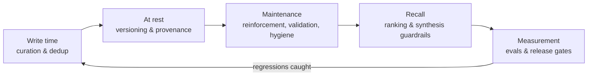

# Memory quality

A memory layer is only useful if what it recalls is **true, current, and actually relevant**. Memory Layer treats that as a defense-in-depth problem: quality is enforced when memories are written, while they sit at rest, at the moment they are recalled, and by measurement gates that catch regressions before a release.

This page is the map. Each section summarizes one mechanism and links to the detailed description and reference material.

## Write time

### Curation and lexical dedup

Raw captures never become memory directly. Curation extracts candidate assertions, drops noise, and checks each candidate against existing knowledge. An exact re-observation does not create a duplicate — it raises the existing memory's confidence and importance instead. When a candidate overlaps an existing memory strongly (shared wording, files, tags, or explicit update language), a replacement decision engine either supersedes the old memory in place or queues a human-reviewed proposal, governed by the per-repo `conservative` / `balanced` / `aggressive` replacement policy.

**Read more:** [How it works — curation](/docs/how-it-works) · [`memory curate` and `memory proposals`](/docs/reference/cli/capture-curation) · [Project config](/docs/reference/config-project)

### Semantic dedup and conflict detection

Lexical overlap misses paraphrases: "deploys ship after checks pass" and "releases publish once verification completes" share almost no words. Once chunk embeddings are built, a semantic pass compares new memories against the project by cosine similarity. Near-duplicates are linked and queued as human-gated merge proposals. Pairs with high embedding similarity but low lexical overlap *and* supersede/negation cues are flagged as likely **contradictions** — an old fact versus a new one — and routed to review as conflicts, never merged automatically.

**Read more:** [`[curation]` config section](/docs/reference/config-global#curation-section) · [`memory proposals`](/docs/reference/cli/capture-curation#memory-proposals)

## At rest

### Immutable versioning

Nothing destructive happens to accepted knowledge. Replacements, corrections, and rewordings append a new version under the same canonical identity; the old version stays available to history-aware queries and every change can be reverted. This is what makes the rest of the machinery safe to automate.

**Read more:** [Memory types and lifecycle](/docs/how-it-works/memory-types) · [Database schema](/docs/reference/database-schema)

### Provenance verification

Memories cite their evidence: files, symbols, commits, prompts. A background verifier re-checks that cited files still exist and cited symbols still appear in the code graph. Verification never deletes anything — a memory whose evidence went missing is *down-ranked* at query time and surfaced with a diagnostic, and the rate of change in a memory's source files feeds its volatility, which schedules it for earlier re-validation.

**Read more:** [`memory verify-provenance`](/docs/reference/cli/query-briefings#memory-verify-provenance) · [Retrieval and search](/docs/how-it-works/retrieval-search)

## Maintenance

### Activation scoring (reinforcement)

Every memory earns an activation score from real usage: being cited in a synthesized answer counts most, appearing in results counts, direct reads count a little. Scores decay exponentially between accesses and spread to related memories with fan normalization, following the ACT-R activation model from cognitive science. Activation gives ranking a tie-breaking usage signal and tells the validation pipeline which memories are hot enough to be worth re-checking.

**Read more:** [Self-maintaining memory](/docs/how-it-works/reinforcement) · [`memory scores`](/docs/reference/cli/reinforcement)

### Evidence-backed validation

When a hot memory crosses the activation threshold, the pipeline gathers deterministic evidence — sources, provenance status, related memories, recent git history — and asks an LLM for a verdict under strict rules: it may cite only evidence it was shown, and any verdict citing anything else is rejected outright. The cardinal rule is that **weak or contradictory evidence never edits content**: corrections are always human-gated, and ambiguous verdicts only flag the memory `needs review`, which rank-penalizes it until a person resolves it.

**Read more:** [Validation](/docs/how-it-works/reinforcement#validation) · [`memory validate` and `memory review`](/docs/reference/cli/reinforcement) · [TUI review queue](/docs/tui/review)

### Hygiene automations

Background loops propose cleanups over the existing corpus: merging likely duplicates, deprecating stale low-confidence memories, and linking related facts. Loop proposals are risk-tiered, budgeted, sandboxed, and land in the same human review queue as everything else — the loops never mutate memory directly.

**Read more:** [Automations](/docs/automations) · [TUI automations tab](/docs/tui/automations)

### Consolidation and insights

Recall of many small, related memories is worse than recall of one that sees the whole picture. Consolidation discovers clusters of related memories and synthesizes a higher-level **`insight`** memory that summarizes them — and, crucially, names the unifying concept, the internal tensions or contradictions, the open gaps, and the implications for design or refactoring. This is where the memory layer stops being a filing cabinet and starts producing understanding.

Clusters are found by fusing three signals into one graph and running community detection over it: memory **relations**, embedding **similarity**, and **co-access** (memories retrieved or cited together in the same query). A value gate keeps only clusters that are cohesive and either salient (**used** together) or dense-but-cold (**not used** individually) — so consolidation triggers on both use and neglect, and noise is left unconsolidated. Synthesis is a two-step LLM pass with the same citable-evidence guard as validation: it may only reference the member memories it was shown. The result is a human-gated proposal that, once approved, inserts the insight, links it to each member with a `summarizes` relation, and records the members as provenance — atomically, in one review. Insights are ordinary memories, so a later run consolidates insights into higher-level insights: a schema tree that grows with the project.

The mechanism is grounded in memory science — complementary learning systems and schema consolidation, sleep-replay gist extraction, the reflection trees of generative agents, and hierarchical summarization (RAPTOR, GraphRAG). It is off by default and dry-run first, like validation.

**Read more:** [Consolidation and insights](/docs/how-it-works/consolidation) — the full mechanism, triggers, and cited science · [`[consolidation]` config section](/docs/reference/config-global#consolidation-section) · [`memory proposals`](/docs/reference/cli/capture-curation#memory-proposals)

## Recall

### Hybrid retrieval and ranking

Recall quality starts with finding the right candidates: lexical full-text, semantic embedding, and code-graph retrieval run together and their results are fused. Ranking then combines match strength with quality signals — confidence, importance, recency, relation links, activation — and applies penalties: weak matches are damped, `needs review` memories are down-weighted, and missing-provenance decay pulls stale evidence down. Every result carries a score explanation so you can see exactly why it ranked where it did.

**Read more:** [Retrieval and search](/docs/how-it-works/retrieval-search) · [`memory query`](/docs/reference/cli/query-briefings)

### Answer synthesis guardrails

Synthesized answers cite the specific memories they draw from, and those citations feed back into activation scoring. When the best match is too weak to support an answer, the query returns `insufficient_evidence` instead of guessing — the design preference is refusing over fabricating. Hardening this guardrail is an active workstream: the adversarial canary below currently documents the cases it still gets wrong.

**Read more:** [Ranking diagnostics](/docs/how-it-works/retrieval-search#ranking-diagnostics) · [Query and briefings CLI](/docs/reference/cli/query-briefings)

## Measurement

### Eval suites and release gates

Scoring changes are easy to get wrong, so quality is measured, not assumed. The eval harness runs paired conditions (no-memory baseline versus full memory) over reviewed suites and gates releases on the deltas. The **memory-quality canary** (`evals/suites/memory-quality-v1`) adds adversarial items: seeded stale facts with fresher contradictions, vague rumors, and unanswerable questions, asserting the pipeline refuses or prefers the fresh fact. Its gate enforces absolute floors — including zero tolerated adversarial failures.

Honest status: the adversarial group currently **fails** — deterministic synthesis still echoes superseded facts as supporting context and does not refuse on weak evidence. The gate stays red on that group until those fixes land; that is the canary doing its job.

**Read more:** [Evaluating Memory](/docs/evals) · [Eval CLI](/docs/reference/cli/integrations-evals)

## Summary table

| Mechanism | Stage | Quality signal | Human in the loop? |
|---|---|---|---|
| Curation & lexical dedup | Write | Token overlap, shared files/tags, update language | Proposals for ambiguous replacements |
| Semantic dedup & conflicts | Write | Chunk-embedding cosine similarity, polarity cues | Always (merge/conflict proposals) |
| Immutable versioning | Rest | — | Revert via history |
| Provenance verification | Rest | File/symbol existence, source churn | Diagnostics only |
| Activation scoring | Maintenance | Retrievals, citations, reads, graph proximity | No (deterministic) |
| Evidence-backed validation | Maintenance | LLM verdict over gathered evidence | Corrections always human-gated |
| Hygiene automations | Maintenance | Duplicate/stale heuristics | Always (proposal queue) |
| Consolidation (insights) | Maintenance | Relation + similarity + co-access clustering, use/non-use salience | Always (consolidate proposal) |
| Hybrid ranking | Recall | Match strength + confidence/recency/activation, penalties | Score explanations for audit |
| Synthesis guardrails | Recall | Citation coverage, refusal threshold | — |
| Evals & gates | Measurement | Paired success rates, adversarial floors | Reviewed suites |

## References

The quality mechanisms are grounded in the memory and retrieval literature rather than invented heuristics.

**Reinforcement (activation scoring):**

- Anderson, J. R. & Schooler, L. J. (1991). [Reflections of the environment in memory.](https://doi.org/10.1111/j.1467-9280.1991.tb00174.x) *Psychological Science* — ACT-R base-level activation: usefulness of a memory tracks recency and frequency of use.
- Petrov, A. A. (2006). [Computationally efficient approximation of the base-level learning equation in ACT-R.](http://alexpetrov.com/pub/iccm06/) *ICCM* — the O(1) incremental form used for the running activation score.
- Collins, A. M. & Loftus, E. F. (1975). [A spreading-activation theory of semantic processing.](https://doi.org/10.1037/0033-295X.82.6.407) *Psychological Review* — spreading activation over related memories.
- Anderson, J. R. (1983). [A spreading activation theory of memory.](https://doi.org/10.1016/S0022-5371(83)90201-3) *Journal of Verbal Learning and Verbal Behavior* — the fan effect behind hub normalization.

**Consolidation (insights):**

- McClelland, J. L., McNaughton, B. L. & O'Reilly, R. C. (1995). [Why there are complementary learning systems in the hippocampus and neocortex.](https://doi.org/10.1037/0033-295X.102.3.419) *Psychological Review* — the fast/slow memory-store division.
- Tse, D. et al. (2007). [Schemas and memory consolidation.](https://doi.org/10.1126/science.1135935) *Science* — consolidation is faster when it attaches to an existing schema.
- Park, J. S. et al. (2023). [Generative Agents.](https://arxiv.org/abs/2304.03442) — reflection: theme extraction, insight synthesis, and reflection trees.
- Sarthi, P. et al. (2024). [RAPTOR.](https://arxiv.org/abs/2401.18059) — recursive embed-cluster-summarize hierarchies.
- Edge, D. et al. (2024). [From Local to Global (GraphRAG).](https://arxiv.org/abs/2404.16130) — community detection plus per-community summaries.
- Raghavan, U. N., Albert, R. & Kumara, S. (2007). [Near linear time algorithm to detect community structures.](https://arxiv.org/abs/0709.2938) — the label-propagation clustering used for consolidation.

See the [consolidation](/docs/how-it-works/consolidation#references) page for how each result maps onto the implementation. Deeper design material lives in the repository: `docs/developer/architecture/memory-reinforcement.md`, `docs/developer/architecture/graph-and-curation-foundations.md`, and `docs/developer/adr/`.
