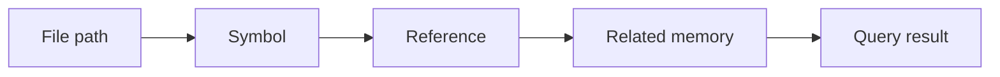

# Retrieval and search

Memory Layer uses more than one retrieval path because project questions come in different forms. Some questions mention exact files or commands. Others describe behavior in natural language. Some need code relationships rather than text similarity alone.

## Retrieval paths

| Path | Best at | Example query |
|---|---|---|
| Full-text search | Exact identifiers, commands, paths, tags, and known wording | “Where is `memory mcp run` implemented?” |
| Semantic search | Related concepts with different wording | “How do agents recover context after interruption?” |
| Graph context | Files, symbols, references, and code ownership links | “What memories are affected by the route split?” |
| Activity lookup | Recent work and operational events | “What happened in the last docs-site session?” |
| History lookup | Memory version chains and tombstones | “Why was this memory replaced?” |

## Embeddings

Canonical memories are chunked and embedded into one or more embedding spaces. Each space records provider, model, dimensions, and chunk metadata. This lets a project keep multiple search backends side by side while switching the active retrieval space.

Typical reasons to rebuild embeddings:

- provider or model changed
- dimensions changed
- many memories were added before embeddings were configured
- diagnostics report missing coverage
- semantic retrieval quality regressed

Use:

```bash
memory embeddings status --project <project-slug>
memory embeddings rebuild --project <project-slug>
```

## Graph-aware retrieval

The code graph links memories to files, symbols, references, and repository structure. This helps when a future question names a code object rather than the exact words in a memory.



Graph context is especially useful after refactors. If a module moved but the memory remains behaviorally true, curation can update navigation facts instead of losing the old knowledge.

## Ranking diagnostics

Query results expose why they were returned. Depending on configuration, diagnostics can include:

- full-text score
- semantic similarity
- graph or relation boost
- tag and path matches
- confidence and importance
- recency
- activation ([reinforcement](/docs/how-it-works/reinforcement) usage boost, and a penalty for memories flagged needs-review)
- retrieval and answer-generation timing

Use these diagnostics to decide whether an answer is grounded. A high-quality answer should cite relevant memories and show plausible match reasons, not just produce fluent text.

## Failure modes

| Symptom | Likely cause | First check |
|---|---|---|
| Good exact query returns nothing | Wrong project slug or missing memory | `memory stats --project <slug>` |
| Semantic search is empty | Embeddings missing or provider down | `memory embeddings status --project <slug>` |
| File-specific query misses context | Repo index or graph stale | `memory repo inspect`, `memory graph inspect` |
| Answer cites old facts | Memory needs replacement review | TUI Review tab or `memory proposals` |
| Query works in CLI but not UI | Service or API token mismatch | `memory status --project <slug>` |
