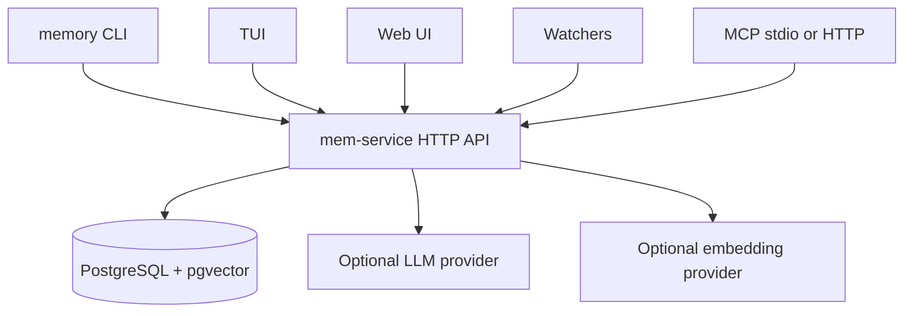

# Runtime topology

Memory Layer is built around one shared service and database. The CLI, TUI, web UI, watcher manager, and MCP server are adapters around the same project-scoped backend.



## Components

| Component | Role |
|---|---|
| `memory` CLI | Human and agent automation surface. |
| `mem-service` | Local HTTP API, web UI host, curation pipeline, embedding jobs, MCP HTTP mount. |
| TUI | Terminal dashboard for humans reviewing memory, evidence, agents, and diagnostics. |
| Web UI | Web companion using the same service APIs as the TUI. |
| Watchers | Background processes that observe agent sessions and report activity. |
| MCP server | Read-first protocol adapter for MCP clients; it reuses the service API. |
| PostgreSQL | Durable store for projects, memories, captures, activities, history, graph data, and embeddings. |

## Configuration layers

| Layer | Typical contents |
|---|---|
| Global config | Database URL, service URL, API token, providers, service preferences. |
| Project config | Project slug, repo root, project-specific options. |
| Repo-local `.agents/` | Agent instructions and Memory Layer skills. |
| Runtime state | Checkpoints, service status, watcher heartbeats, generated logs. |

Do not commit secrets, API keys, database URLs, or local runtime state. Repo-local project identity and agent instructions are normally safe to commit after review.

## Service ports and modes

Packaged installs normally run the service in the background through systemd on Linux or launchd on macOS. Development runs use the foreground command:

```bash
memory service run
```

The foreground command should keep running in the terminal and should not daemonize itself. If you need background operation, use the packaged service manager.

## MCP as an adapter

The built-in MCP server exposes read-first Memory tools to clients such as Codex and Claude. It does not write directly to the database. Stdio MCP runs as a local process; HTTP MCP is mounted by the service and should stay local and token-protected.

## Operational rule

When something looks wrong, check the layers in order:

```bash
memory doctor
memory health
memory status --project <project-slug>
```

Then inspect the TUI Errors tab, service logs, watcher status, and embedding diagnostics.
