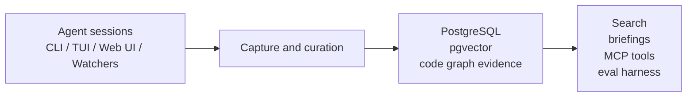

# Memory Layer

Local-first memory for coding agents.

Memory Layer turns project work into durable, searchable knowledge so the next Codex, Claude, MCP client, or human session starts with evidence instead of guesswork.


<CardGroup cols={3}>
  <Card title="Get started" href="/docs/quickstart">
    Install Memory Layer, configure storage, and initialise your first project.
  </Card>
  <Card title="Connect an agent" href="/docs/agents">
    Use Memory Layer from Codex CLI, Claude Code, generic agents, or MCP-capable clients.
  </Card>
  <Card title="Run an evaluation" href="/docs/evals">
    Measure memory impact with paired no-memory versus full-memory ablations.
  </Card>
</CardGroup>

## What is Memory Layer?

Memory Layer captures what happened, curates what matters, stores it with evidence, and retrieves it when future work needs context. It is not just a note-taking tool or a vector database wrapper. It is memory infrastructure for agentic software work.




## Why it matters

Coding agents lose context between sessions. READMEs rarely capture the messy why. Chat histories are hard to search and hard to trust. Memory Layer helps projects reduce rediscovery, preserve decisions, and make memory measurable without promising perfect recall.

## Key capabilities

<CardGroup cols={2}>
  <Card title="Evidence-backed answers">
    Ask a project question and inspect the ranked memories, citations, graph hints, and diagnostics behind the answer.
  </Card>
  <Card title="Agent-ready retrieval">
    Expose memory through CLI commands, the TUI, browser UI, and read-first MCP tools.
  </Card>
  <Card title="Watcher support">
    Attach to Codex and Claude sessions, monitor token pressure, and capture useful activity.
  </Card>
  <Card title="Code graph-aware memory">
    Connect memories to files, symbols, references, and graph relationships.
  </Card>
  <Card title="Human review loop">
    Review replacement proposals before older knowledge is superseded.
  </Card>
  <Card title="Repeatable evaluations">
    Run paired ablations and inspect success, recall, ranking, token, and latency metrics.
  </Card>
</CardGroup>

## Quick start

```bash
memory wizard --global
cd /path/to/project
memory wizard --dry-run
memory wizard
memory doctor
memory health
memory tui
```

## Built to be measured

Memory Layer includes an evaluation harness for paired ablations such as `no-memory` versus `full-memory`. It records immutable artifacts, compares item-by-item results, reports retrieval quality, and tracks token and latency cost.


## Start here

<CardGroup cols={2}>
  <Card title="Install Memory Layer" href="/docs/install" />
  <Card title="Configure a project" href="/docs/install/wizard-project" />
  <Card title="Connect Codex CLI" href="/docs/agents/codex-cli" />
  <Card title="Run the MCP server" href="/docs/mcp" />
  <Card title="Start a watcher" href="/docs/watchers" />
  <Card title="Run an evaluation" href="/docs/evals/run-evals" />
</CardGroup>
