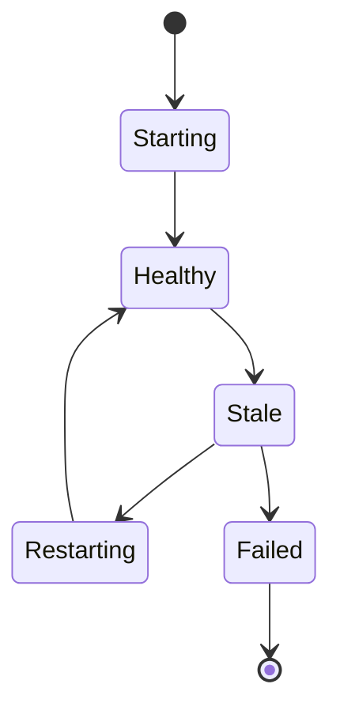

# Lifecycle and heartbeats

Read watcher health states, heartbeats, and recovery behavior.

## Practical guidance

- Prefer local repository facts and current CLI help over stale examples.
- Keep secrets, database URLs, and provider keys out of committed docs.
- Treat Memory Layer as evidence infrastructure: useful results should be inspectable and bounded.
## Verify

```bash
memory doctor
memory health
memory status --project <project-slug>
```

Use command-specific help for exact flags:

```bash
memory --help
memory <command> --help
```

## Next

Return to [Watchers](/docs/watchers) or continue with the related page in the left navigation.

## Watcher lifecycle



