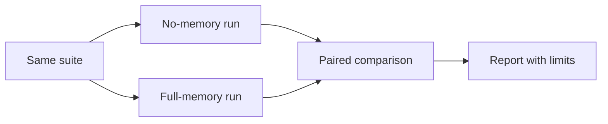

# Ablation tests

Compare no-memory and memory-enabled variants item by item.

## What to measure

Evaluation claims should be tied to artifacts, suite version, commit, model/provider, and configuration. Pair no-memory and memory-enabled variants when possible.

## How to use it

Run a dry run first, then a real suite only after reviewing scripts and fixtures. Keep raw outputs and compare item-level results.

## Verify

```bash
memory eval run --suite evals/examples/memory-smoke --condition full-memory --profile offline --dry-run
```

## Next

Read [Run evaluations](/evals/run-evals), [Metrics](/evals/metrics), and [Limitations](/evals/limitations).

## Ablation flow



