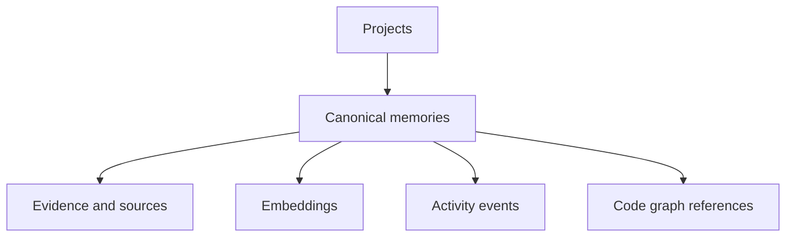

# Database operations

Operate PostgreSQL, pgvector, migrations, and connection settings.

## Checklist

- Know which service instance you are operating.
- Check database connectivity before blaming retrieval.
- Back up state before upgrades or migrations.
- Redact secrets before sharing logs.
- Confirm agent and MCP integrations are scoped to the intended project.

## Verify

```bash
memory health
memory doctor
memory status --project <project-slug>
```

## Next

Read [Security and privacy](/operations/security-and-privacy) and [Troubleshooting](/help/troubleshooting).

## Storage model



