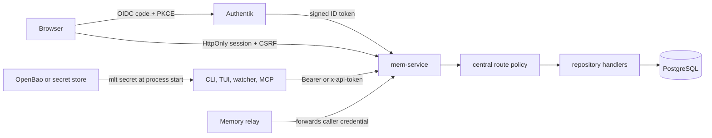

# Authentication And Authorization Architecture

Memory Layer has two explicit operating modes. `single_user` preserves the
local-first shared-token model. `multi_user` makes the service the authorization
boundary for Authentik users and scoped service principals.

## Trust Boundaries

Authentik authenticates people. OpenBao is the preferred distributor for
machine secrets. Memory Layer does not call OpenBao at runtime and OpenBao does
not replace OIDC browser identity.

## Principal Model

Principal kinds are `human_oidc`, `service_token`, `legacy_service_token`, and
`internal`. Effective access is the maximum of a global role, explicit project
memberships, and matching Authentik group rules. Roles are ordered:
`reader < writer < operator < admin`.

The service resolves credentials once in central middleware, resolves the
resource project from path/body/query/resource ID, applies the route policy,
and inserts an authenticated principal extension for handlers. Mutating
handlers receive the legacy internal API token only after authorization so old
repository guards remain an internal defense rather than the authority.

In multi-user mode, capture writer identity, workspace writer identity, loop
setting attribution, and proposal reviewers are stamped from the server-side
principal. Client-supplied attribution cannot override them.

## Browser OIDC

The flow uses Authorization Code, PKCE S256, state, nonce, provider discovery,
and JWKS signature validation. Discovery is lazy so service startup and service
tokens still work during an Authentik outage. Redirect following is disabled in
the OIDC HTTP client. Flow rows expire after ten minutes and are consumed once.

The ID token supplies stable issuer/subject identity plus display name, email,
and the configured groups claim. Provider access and refresh tokens are not
persisted. The browser receives:

- `memory_session`: opaque, HttpOnly, SameSite=Lax, Secure on HTTPS;
- `memory_csrf`: opaque, readable by the bundled UI, SameSite=Lax;
- a server-side session row containing hashes only, with a 12-hour default TTL.

Mutating cookie-authenticated requests require the exact Origin derived from
`auth.public_base_url` and an `x-csrf-token` matching the session.

## Service Tokens And Transports

Service-token secrets are high-entropy `mlt_...` values. Only a SHA-256 hash and
a non-secret prefix are stored. The raw token is returned only by create.

- HTTP accepts `Authorization: Bearer` or `x-api-token`; conflicting values are
  rejected.
- HTTP MCP deliberately ignores browser cookies and requires a service token in
  multi-user mode. Tool calls forward the request credential to the service API.
- TUI Cap'n Proto sessions authenticate in their first protocol frame.
- Browser WebSockets use the authenticated browser session.
- Relays proxy the original authorization/cookie headers to the primary; they do
  not replace the caller with a relay-wide privileged token.

## Storage

Migration `0026_multiuser_auth.sql` adds principals, token hashes, project
memberships, browser sessions, short-lived OIDC flows, and auth audit events.
These tables refer to existing projects but do not create a second persistence
path for memory content.

## Migration And Rollback

1. Configure Authentik and group mappings while still in `single_user` mode.
2. Create or identify the first global-admin mapping.
3. Set the OIDC client secret environment variable and validate discovery.
4. Switch to `multi_user`; use the legacy bootstrap flag only if no admin can
   sign in yet.
5. Create scoped service tokens for every CLI/watcher/MCP workload, distribute
   them from a secret manager, then disable legacy bootstrap.

Rollback is a config change back to `single_user`; do not reverse migration
0026. Existing auth rows remain inert and preserve the audit trail. Before
rollback, consider whether widening every local client back to the shared token
is acceptable.

## Failure Behavior

- Authentik unavailable: new browser logins return `503`; existing sessions and
  service tokens continue.
- Missing/invalid/expired/revoked credential: `401`.
- Valid principal without role/project access: `403`.
- Browser Origin or CSRF failure: `403`.
- No primary available to a relay: `503`.

The implementation is split under `crates/mem-service/src/auth/`; public config
and response contracts live in `mem-api`, while `web/src/features/access/` owns
the browser administration surface.
