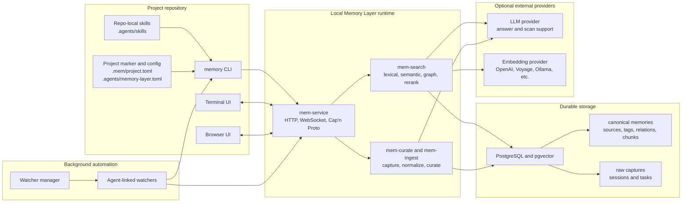

# Memory Layer Architecture

This page is a short architecture overview for developers. For the detailed runtime model, use [How Memory Layer Works](how-it-works.md). For the curated memory categories themselves, use [Memory Types Reference](memory-types.md).

## Table of Contents

- [Overview](#overview)
- [Architecture Diagram](#architecture-diagram)
- [Main Components](#main-components)
- [High-Level Flows](#high-level-flows)
- [Design Principles](#design-principles)

## Overview

Memory Layer is a local-first project memory system.

Its job is simple:

1. collect useful project knowledge
2. store it in PostgreSQL
3. let people and coding agents search it later

It keeps two kinds of data:

- raw captures: the original task context, notes, changed files, and tests
- curated memories: shorter long-lived facts derived from those captures

That split is important because it keeps the system auditable. You can see where a memory came from instead of treating it like a black box.

The architecture is split into five parts:

1. a skill layer for agent workflow
2. a CLI and TUI for daily use
3. a backend service for storage and retrieval
4. PostgreSQL for durable data
5. an optional watcher manager and watcher processes for background capture

## Architecture Diagram

This diagram shows the main runtime boundaries. For deeper write and query pipeline diagrams, see [How Memory Layer Works](how-it-works.md).

## Main Components

### Skill

The repo-local Memory Layer skill bundle in `.agents/skills/` tells Codex when to:
- initialise or refresh Memory Layer setup for a target project
- query memory before answering project-specific questions
- resume after interruptions
- review pending memory replacement proposals
- save approved plans before execution
- save direct task starts when implementation begins without an approved plan
- verify plan-backed work before claiming completion
- remember meaningful work

The umbrella skill lives in `.agents/skills/memory-layer/`, and the focused skills live beside it.
The bundle is the main driver for coding agent interaction with Memory Layer. In practice, the
skill workflow decides when the agent should use memory, while the shared Go helper in
`.agents/skills/memory-layer/scripts/` is the execution path that actually calls `memory`.
That repo-local helper runs through `go run`, so `go` must be available on `PATH` anywhere the
skill bundle is expected to execute.

For the detailed runtime model of skill discovery, selection, and template bootstrapping, use
[How Skills Work](../skills/how-skills-work.md).

### CLI (`memory`)

`memory` is the main user entrypoint for:
- repo bootstrap (`init`)
- query
- remember
- `capture task`
- curate
- `embeddings reindex`
- TUI views
- automation status and controls

The CLI currently uses two transports:
- a localhost HTTP API kept as the compatibility and fallback surface
- a persistent Cap'n Proto connection for live TUI subscriptions

Initialized repositories keep a tiny project marker under `.mem/project.toml`, agent-visible behavior under `.agents/`, and operational project config/state/cache under user-local Memory Layer directories. Shared defaults live in the global config and project-local values can override them when needed.

### Backend Service (`memory service`)

The backend owns:
- API routes
- persistent streaming transport
- raw capture ingestion
- deterministic curation
- retrieval and ranking
- provenance
- stats and operational reporting

### PostgreSQL

PostgreSQL stores:
- projects
- sessions
- tasks
- raw captures
- canonical memories
- provenance
- search chunks
- curation runs

### Automation (`memory watcher`)

`memory watcher` is an optional background process. The recommended local automation model is the Codex-linked watcher manager, which detects live Codex sessions and starts one watcher per session. Legacy per-project watcher services and manual foreground watchers remain compatibility paths.

It does not write directly to database tables. It only orchestrates the existing persistence path.

## High-Level Flows

### Query Flow

1. User asks a project-specific question
2. Skill or CLI runs `memory query`
3. Backend retrieves project memory from PostgreSQL
4. Ranked results and provenance are returned

### Live TUI Flow

1. `memory tui` loads an initial project snapshot
2. It opens a persistent Cap'n Proto connection to the backend
3. It subscribes to project-level and selected-memory updates
4. Backend pushes snapshot refreshes after relevant writes
5. The TUI redraws without requiring manual refresh

### Remember Flow

1. Meaningful work is completed
2. Skill, user, or automation daemon runs `memory remember`
3. CLI builds a capture request
4. Backend stores a raw capture
5. Backend curates it into canonical memory
6. Memory becomes queryable

### Automation Flow

1. the watcher manager detects an agent session, or a user starts a legacy/manual watcher
2. `memory watcher` observes file and command activity for a repo
3. It accumulates a task window
4. After idle time or explicit flush, it decides whether to create a raw capture
5. After enough raw captures accumulate, it can trigger curation
6. It records the decision in a local audit log

## Design Principles

- Local-first
- Deterministic by default
- No canonical memory without provenance
- Project-scoped memory
- Auditability over hidden magic

## Related Docs

- [How Memory Layer Works](how-it-works.md)
- [Graph And Curation Foundations](graph-and-curation-foundations.md)
- [Hidden Memory Daemon](hidden-memory-daemon.md)
- [Developer Documentation](../README.md)
- [User Documentation](../../user/README.md)
