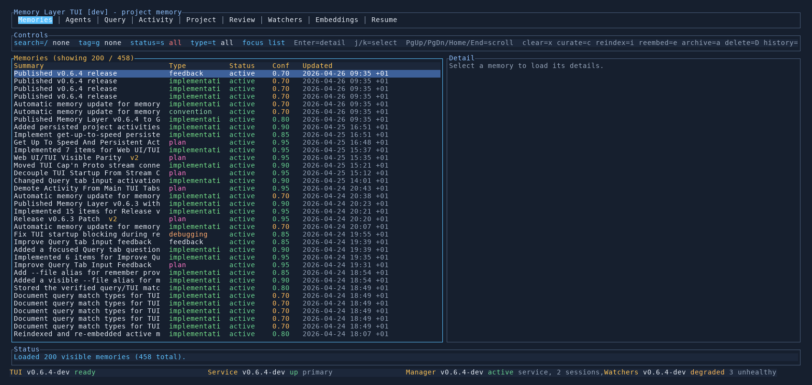

# Memory Layer Docs

Memory Layer is a local-first project memory system for coding agents and developers. These docs cover installation, day-to-day usage, the TUI, and the internal architecture.

## Start Here

- [Getting Started](user/getting-started.md)
- [TUI Guide](user/tui/README.md)
- [User Documentation Index](user/README.md)

## CLI Reference

- [Wizard And Bootstrap](user/cli/wizard.md)
- [Service Commands](user/cli/service.md)
- [Doctor Diagnostics](user/cli/doctor.md)
- [Remember Command](user/cli/remember.md)
- [Checkpoint Workflow](user/cli/checkpoint.md)
- [Watcher Health](user/cli/watchers.md)

## Developer Docs

- [Developer Documentation Index](developer/README.md)
- [How Skills Work](developer/skills/how-skills-work.md)
- [Architecture Overview](developer/architecture/overview.md)
- [Memory Types Reference](developer/architecture/memory-types.md)
- [How Memory Layer Works](developer/architecture/how-it-works.md)
