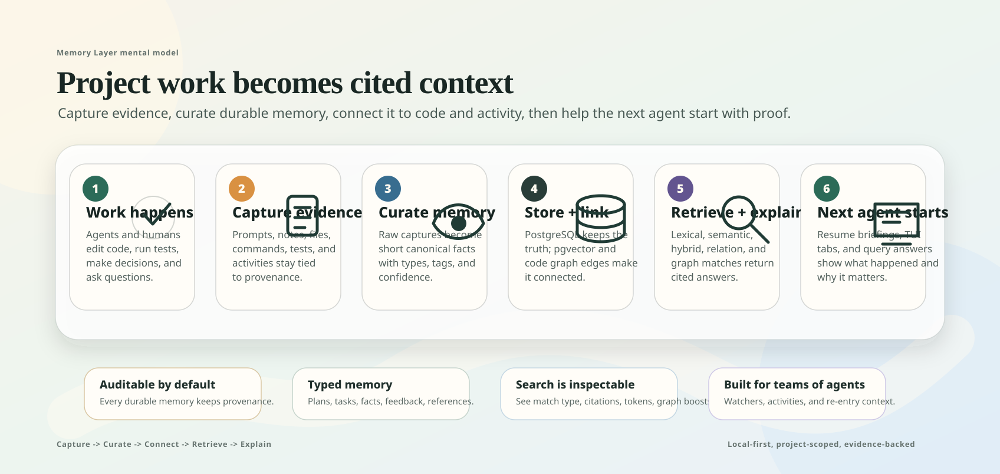

# User Documentation

This section is for people installing, configuring, and using Memory Layer in real projects.

If you are new, start with the TUI. It shows the main product surface: cited memory search, graph-aware retrieval diagnostics, live agent state, activity history, watcher health, embedding coverage, and curated project memory.

## Table of Contents

- [Start Here](#start-here)
- [Reference](#reference)
- [Related Docs](#related-docs)

## Start Here

- **Install and configure:** [Getting Started](getting-started.md), [Wizard And Bootstrap](cli/wizard.md), [Init Bootstrap](cli/init.md), [Skill Upgrade](cli/upgrade.md)
- **Use the visual UIs:** [TUI Guide](tui/README.md), [Web UI](web-ui.md), [TUI Command](cli/tui.md), [Memories Tab](tui/memories.md), [Query Tab](tui/query.md), [Errors Tab](tui/errors.md)
- **Ask useful questions:** [Query Command](cli/query.md), [Source Provenance Verification](cli/verify-provenance.md), [Code Graph Extraction](cli/graph.md), [Embedding Operations](cli/embeddings.md)
- **Operate agents:** [Agent Workspace Coordination](cli/agents.md), [Agents Tab](tui/agents.md), [Watcher Health](cli/watchers.md), [Activity Tab](tui/activity.md), [Get Up To Speed](cli/up-to-speed.md), [MCP Server](cli/mcp.md), [Loop Automations](cli/loops.md)
- **Measure impact:** [Beginner Guide To Evaluations](evaluation-guide.md), [Automated Evaluation](cli/eval.md)
- **Troubleshoot:** [Status](cli/status.md), [Doctor Diagnostics](cli/doctor.md), [Health](cli/health.md), [Stats](cli/stats.md), [Errors Tab](tui/errors.md), [Release Compatibility](release-compatibility.md)

## Reference

- [TUI Guide](tui/README.md)
- [Web UI](web-ui.md)
- [Resume Tab](tui/resume.md)
- [Memories Tab](tui/memories.md)
- [Agents Tab](tui/agents.md)
- [Query Tab](tui/query.md)
- [Activity Tab](tui/activity.md)
- [Errors Tab](tui/errors.md)
- [Project Tab](tui/project.md)
- [Review Tab](tui/review.md)
- [Watchers Tab](tui/watchers.md)
- [Embeddings Tab](tui/embeddings.md)
- [Wizard And Bootstrap](cli/wizard.md)
- [Init Bootstrap](cli/init.md)
- [Skill Upgrade](cli/upgrade.md)
- [Service Commands](cli/service.md)
- [Status Command](cli/status.md)
- [Doctor Diagnostics](cli/doctor.md)
- [Health And Stats](cli/health.md)
- [Stats Command](cli/stats.md)
- [Query Command](cli/query.md)
- [Source Provenance Verification](cli/verify-provenance.md)
- [TUI Command](cli/tui.md)
- [Agent Workspace Coordination](cli/agents.md)
- [Shell Completion](cli/completion.md)
- [Activities Command](cli/activities.md)
- [Get Up To Speed](cli/up-to-speed.md)
- [Checkpoint Workflow](cli/checkpoint.md)
- [Capture Command](cli/capture.md)
- [Remember Command](cli/remember.md)
- [Curate Command](cli/curate.md)
- [Proposals Command](cli/proposals.md)
- [History Command](cli/history.md)
- [Prune History](cli/prune-history.md)
- [Embedding Operations](cli/embeddings.md)
- [Code Graph Extraction](cli/graph.md)
- [Repository Index](cli/repo.md)
- [Dev Command](cli/dev.md)
- [Automated Evaluation](cli/eval.md)
- [Memory Bundles](cli/bundles.md)
- [Watcher Health](cli/watchers.md)
- [Resume Briefings](cli/resume.md)
- [Scan Command](cli/scan.md)
- [Commit History](cli/commits.md)
- [Archive Command](cli/archive.md)
- [Automation Commands](cli/automation.md)
- [Loop Automations](cli/loops.md)
- [Release Compatibility And Known Limitations](release-compatibility.md)

## Related Docs

- [Developer Documentation](../developer/README.md)
- [Project README](../../README.md)
