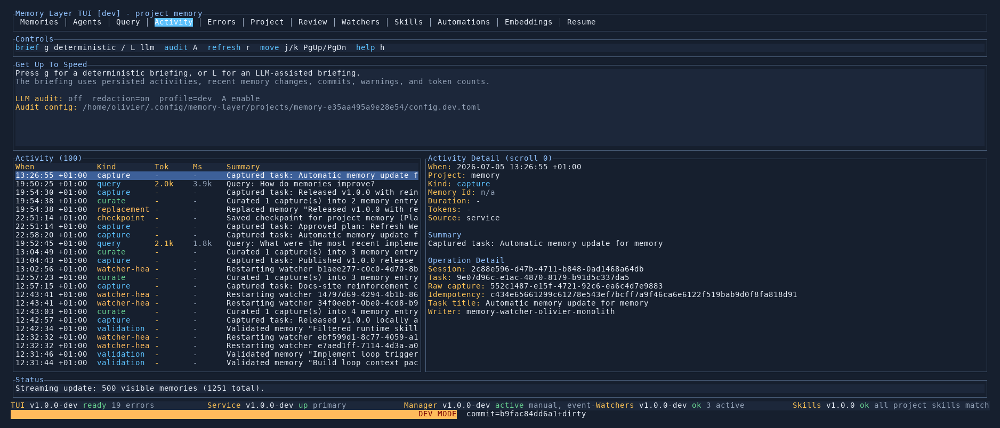

# Activity Tab

The `Activity` tab shows the recent operational history for the project so you can see what the system and its users have been doing.

## What It Shows

- recent backend events such as capture, curate, scan, reindex, re-embed, replacement, and checkpoint activity
- recent queries and whether they succeeded
- watcher-health transitions such as stale, restarting, failed, and recovered
- a detail pane for the selected event

This is the fastest way to answer "what just happened?" in the current project.

## Key Controls

- `j/k` move through recent activity
- the detail pane updates as the selected row changes
- `r` refresh project state if you want the latest non-streamed data as well

## When To Use It

- verifying that a `scan`, `remember`, or curate action actually ran
- reviewing the latest query and backend write history
- understanding watcher failures or recovery events

## See Also

- [Watcher Health](../cli/watchers.md)
- [Resume Briefings](../cli/resume.md)
- [TUI Guide](README.md)
