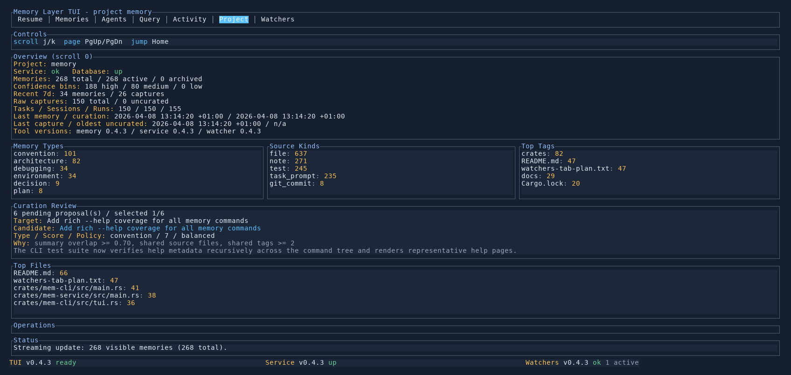

# Agents Tab

Use the `Agents` tab to monitor local Codex and Claude sessions across projects without leaving Memory Layer.

## What It Shows

- one row per visible agent session across local projects
- project, agent type, status, token volume, context-window percentage, and current task
- selected-session details such as PID, session id, cwd, model, git state, and child processes
- account-level rate-limit summaries when available
- orphan listening ports detected from child processes whose parent session ended

This tab is read-only. It is inspired by `abtop`, but it uses Memory Layer's own layout and controls.

## Key Controls

- `Tab` or `h/l` move into and out of the tab
- `j/k` move between visible sessions
- `PgUp/PgDn` scroll the detail pane
- `Home` jump detail scrolling back to the top
- `r` refresh the wider Memory project state; agent session collection also keeps updating in the background

## When To Use It

- seeing all active coding-agent sessions in one place
- checking whether a session is working, waiting, or done
- spotting context-window pressure or rising token usage
- finding child processes and open ports started by an agent session
- checking rate-limit state without opening a separate tool

## See Also

- [TUI Guide](README.md)
- [Activity Tab](activity.md)
