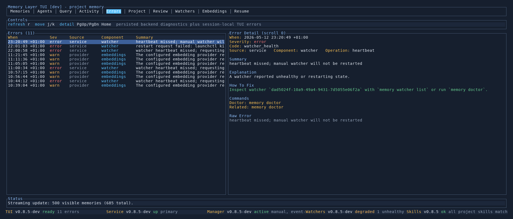

# Errors Tab

The Errors tab collects operational problems that would otherwise be hidden in service logs or short status messages.

Use it when the bottom bar shows an error count, a provider request fails, watchers look unhealthy, queries fail, or the TUI cannot explain why a tab is empty.

## What It Shows

- persisted backend diagnostics for the current project
- provider quota/auth failures from embedding or LLM calls
- query/search failures
- watcher stale, failed, and restarting events
- session-local TUI errors from tabs such as Query, Activity, Agents, Resume, and Embeddings

The left pane lists errors by time, severity, source, component, and summary. The right pane explains the selected error.

## Detail Pane

Each diagnostic can include:

- a stable code, for example `embedding_quota_exceeded`
- source, component, and operation
- a concise explanation
- a fix hint
- a `memory doctor` hint when health checks can help
- a related command, such as `memory embeddings list`
- the raw error chain for deeper debugging

## Controls

- `j` / `k` moves through errors
- `PgUp` / `PgDn` scrolls the detail pane
- `Home` jumps the detail pane back to the top
- `r` refreshes activity-backed diagnostics

## Common Examples

`embedding_quota_exceeded` means memory storage succeeded, but automatic embedding creation failed because the configured embedding provider rejected the request. Restore provider quota/billing, disable automatic creation for the failing backend, or rerun explicit embedding maintenance after fixing the provider.

`auth_invalid_token` means a client, watcher, manager, service, or provider rejected the configured token. Run `memory doctor`, refresh the relevant config, and restart the affected component.

`database_pgvector_missing` means PostgreSQL does not have the pgvector extension available in the memory database. Install pgvector and run `CREATE EXTENSION IF NOT EXISTS vector;` in the configured database.
