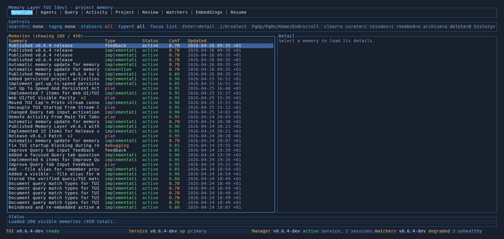

# Memories Tab

The `Memories` tab is the main browsing view for canonical project memory.

## What It Shows

- a filterable memory list on the left
- the selected memory entry in detail on the right
- summary, validation proof, suggested replacement diff, canonical text, type, confidence, tags, sources, and related memories

This is the best tab for reading what Memory Layer already knows about a project.

## Validation Proof

Press `v` on a selected memory to search for proof and run a dry-run validation.
The TUI starts from the memory's recorded source files, related memories, and git
history. If that evidence is weak, it falls back to a bounded repository scan.

The result appears in the detail pane and shows:

- verdict, confidence, action, proof scope, and whether fallback was used
- supporting, contradicting, and neutral evidence
- reasons from the validator
- a diff-style suggested replacement when the memory should be reworded or corrected

Validation from the Memories tab is preview-first: pressing `v` does not rewrite
the memory text. If the visible preview looks right, press `y` to apply that
exact preview as a new immutable memory version. Press `n` to dismiss the
preview locally.

## Related Memories

The `Related memories` section is a navigation aid, not a hand-curated truth table.

Those links are computed automatically during curation from strong text overlap, shared tags, shared provenance file paths, and explicit dependency or supersession language. They are useful for finding nearby context, but they are still heuristic.

## Key Controls

- `j/k` move through the memory list
- `PgUp/PgDn` scroll the selected memory detail
- `Home` jump the detail pane back to the top
- `/` edit the text filter
- `g` edit the tag filter
- `s` cycle status filters
- `t` cycle memory-type filters
- `x` clear all active filters
- `c` run curation
- `v` validate the selected memory with proof search
- `y` apply the visible validation preview
- `n` dismiss the visible validation preview
- `i` reindex memory chunks
- `e` re-embed the active embedding space
- `a` archive low-value memories
- `Shift+D` delete the selected memory
- `h` open or close detailed help for this tab

## When To Use It

- browsing architecture or workflow knowledge already in the system
- checking whether a fact is already stored before adding more memory
- inspecting provenance on an existing memory entry
- doing maintenance work such as curate, reindex, or re-embed

## See Also

- [Remember Command](../cli/remember.md)
- [Embedding Operations](../cli/embeddings.md)
- [TUI Guide](README.md)
