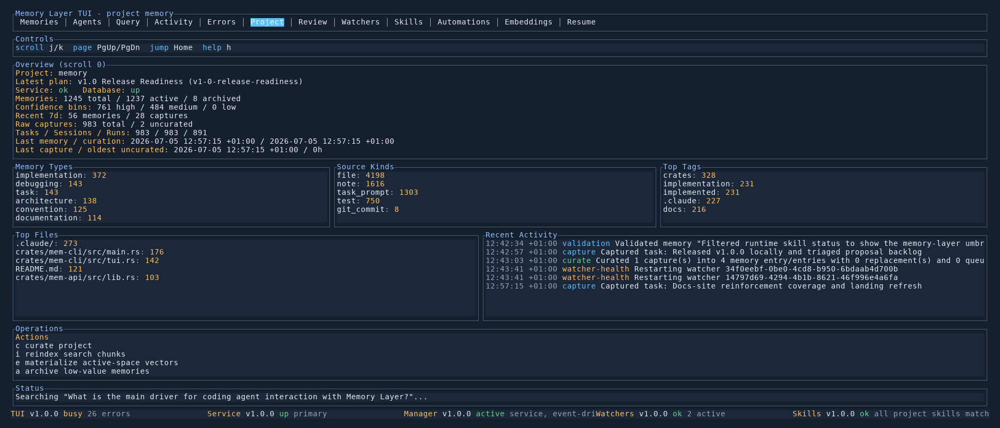

# Project Tab

The `Project` tab is the high-level health and maintenance dashboard for the current project.

## What It Shows

- project-wide counts for memories, captures, sessions, and curation runs
- recent-memory timing and confidence breakdowns
- embedding and automation status
- top tags and top files
- replacement-policy status and pending replacement proposals
- a compact watcher summary

This tab is where you look when the question is about project state rather than one specific memory.

## Key Controls

- `j/k` scroll the tab
- `PgUp/PgDn` page through longer project summaries
- `Home` jump back to the top
- `p` cycle the curation replacement policy
- `[` and `]` move between pending replacement proposals
- `y` approve the selected proposal
- `n` reject the selected proposal

## When To Use It

- checking whether the project is healthy
- reviewing embedding coverage or automation state
- approving or rejecting queued memory replacements
- understanding top files, tags, or memory-type distribution

## See Also

- [Embedding Operations](../cli/embeddings.md)
- [Watcher Health](../cli/watchers.md)
- [TUI Guide](README.md)
