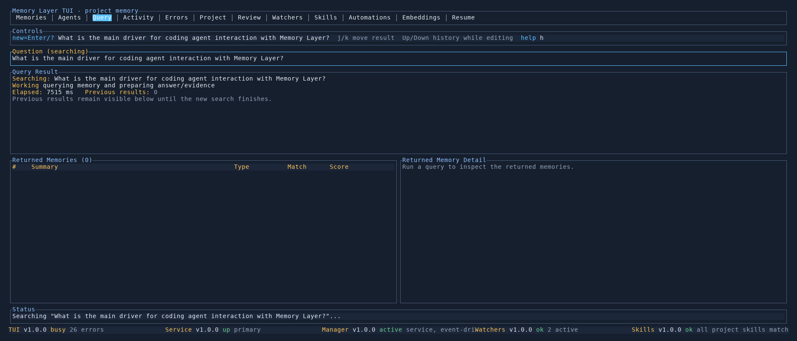

# Query Tab

Use the `Query` tab to ask a scoped question against project memory and inspect the ranked results without leaving the TUI.

## What It Shows

- the current question in the controls row
- the answer summary and diagnostics
- the returned matching memories
- the selected result in more detail, including why it ranked well

You can jump into query mode from anywhere in the TUI with `?`.

## Key Controls

- `?` switch to the `Query` tab and start editing a question
- type your question and press `Enter` to run it
- `Esc` cancel query input
- `j/k` move through returned results
- `r` refresh project state after backend changes

## When To Use It

- asking "how does this project do X?"
- checking whether a detail was already captured in memory
- exploring retrieved evidence after a fresh `remember`, `scan`, or commit import

## See Also

- [TUI Guide](README.md)
- [Scan Command](../cli/scan.md)
