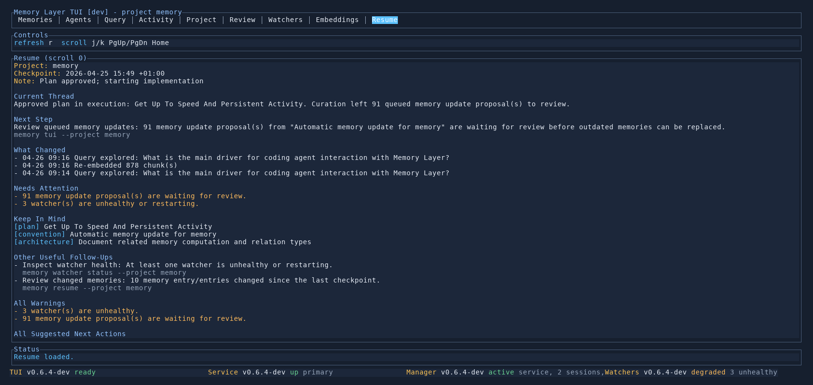

# Resume Tab

Use the `Resume` tab when you come back to a project after an interruption and want a focused re-entry briefing instead of reading raw activity history first.

## What It Shows

- the active project and latest checkpoint
- the inferred current work thread
- one primary next step
- important recent changes
- actionable attention items
- durable context that still matters
- a recent timeline section below the briefing

If a checkpoint exists and the project changed since that checkpoint, the TUI opens on `Resume` first.

## Key Controls

- `j/k` scroll the briefing
- `PgUp/PgDn` page through long briefings
- `Home` jump back to the top
- `r` refresh the resume pack

## When To Use It

- at the start of a work session
- after letting an agent work on the project for a while
- before deciding what to do next after several related changes

## See Also

- [Resume Briefings](../cli/resume.md)
- [TUI Guide](README.md)
