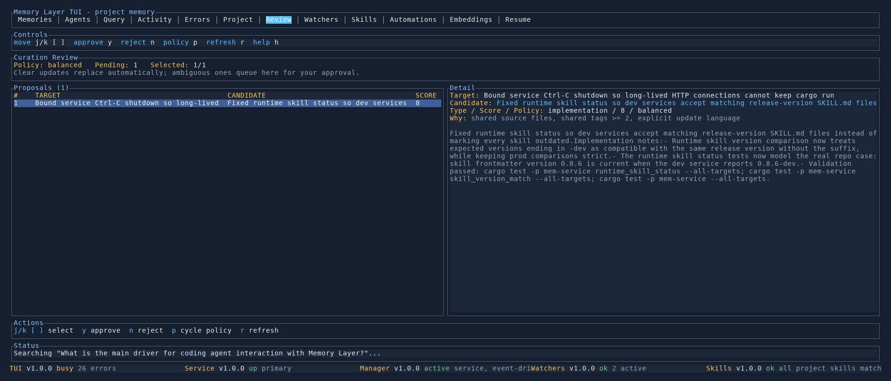

# Review Tab

Shows the queue of pending replacement proposals produced by curation and lets you approve or reject them without leaving the TUI.

## Table of Contents

- [When To Use](#when-to-use)
- [What You See](#what-you-see)
- [Keybindings](#keybindings)
- [How Approval Works](#how-approval-works)
- [Related Docs](#related-docs)

## When To Use

- Curation flagged a candidate that overlaps an existing memory but the signal wasn't strong enough to replace automatically — the candidate landed here instead.
- You just ran `memory remember` on a chunk of work and want to decide whether the new notes should supersede the old ones or coexist.
- The Project tab shows a non-zero "Curation policy / N pending" line and you want to work the queue down.

## What You See

**Header panel**

- `Policy:` the current replacement policy (`conservative` / `balanced` / `aggressive`). Cycles with `p`.
- `Pending:` the total count of queued proposals for this project.
- `Selected:` the 1-based position of the highlighted row in the list.

**Proposals list (left)**

One row per pending proposal, with columns:

| Column | Meaning |
|---|---|
| `#` | list index |
| `TARGET` | summary of the existing memory the proposal would replace |
| `CANDIDATE` | summary of the new memory the proposal would install in its place |
| `SCORE` | similarity score that put this pair over the replacement threshold |

**Detail panel (right)**

Full summaries, the memory type / score / policy that produced the match, the list of reasons the matcher gave (e.g. `summary overlap >= 0.70`, `shared source files`, `shared tags >= 2`), and the full canonical text of the candidate so you can read what would replace the target.

**Actions footer**

One-line legend for the keys below.

## Keybindings

| Key | Action |
|---|---|
| `j` / `↓` / `]` | Move selection down (wraps at the end) |
| `k` / `↑` / `[` | Move selection up (wraps at the start) |
| `PgDn` / `PgUp` | Jump by 8 proposals |
| `Home` / `End` | Jump to first / last proposal |
| `y` | Approve the highlighted proposal — the candidate replaces the target |
| `n` | Reject the highlighted proposal — the candidate is discarded, the target stays |
| `p` | Cycle the replacement policy (persists to `.agents/memory-layer.toml`) |
| `r` | Refresh (global binding; re-fetches proposals along with the rest of the dashboard) |
| `h` | Open or close detailed help for this tab |

Tab movement (`Tab`, `Shift+Tab`, `l`, `Left`) and the quit shortcut (`Ctrl+C`) work as on every other tab.

## How Approval Works

- **Approve** (`y`) calls `POST /v1/projects/<slug>/replacement-proposals/<id>/approve`. The service writes a new version of the target memory whose canonical text comes from the candidate, marks the old version superseded, and removes the proposal from the queue.
- **Reject** (`n`) calls `POST /v1/projects/<slug>/replacement-proposals/<id>/reject`. The proposal is marked resolved and the candidate is discarded; the target memory is untouched.
- **Cycle policy** (`p`) rewrites `[curation].replacement_policy` in the repo's `.agents/memory-layer.toml`. New policy takes effect the next time curation runs — existing queued proposals are not re-evaluated.

After approve/reject the tab fetches a fresh proposal list automatically, so the selection moves to the next pending row.

## Related Docs

- [Project Tab](project.md) — high-level dashboard; shows the pending count as a health signal.
- [Curate command](../cli/curate.md) — how proposals are produced.
- [TUI Guide](README.md) — other tabs and shared navigation.
