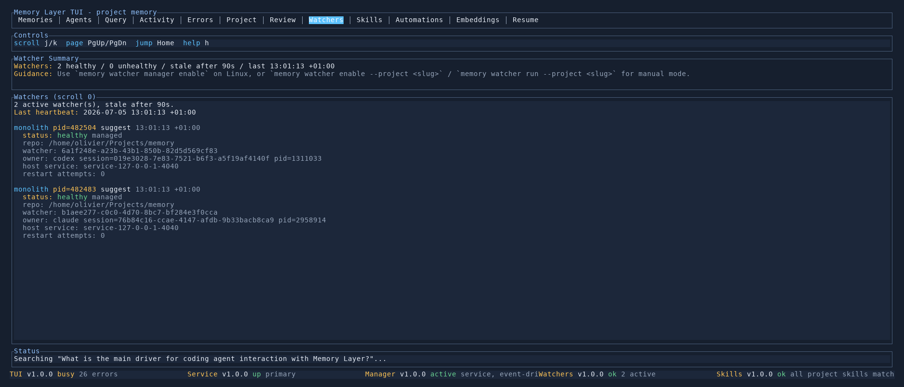

# Watchers Tab

Use the `Watchers` tab to inspect the live watcher processes for the current project.

## What It Shows

- the active watcher summary for the project
- one row per watcher when watchers are present
- host, process, mode, repo root, owning agent session, heartbeat, and restart details
- watcher health states such as `healthy`, `stale`, `restarting`, and `failed`

This tab is specifically for watcher liveness and watchdog status, not for the higher-level project summary.

## Key Controls

- `j/k` scroll the watcher list
- `PgUp/PgDn` page through longer watcher lists
- `Home` jump back to the top
- `r` refresh the project snapshot if you want to force a fresh read

## When To Use It

- confirming that a watcher is running for the current project
- confirming which Codex session owns an agent-linked watcher
- seeing whether a service-managed watcher restarted cleanly
- distinguishing a healthy watcher from a stale or failed one
- checking the project repo root and mode reported by the watcher

## See Also

- [Watcher Health](../cli/watchers.md)
- [TUI Guide](README.md)
